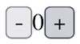

Gren has a few different ways you can write browser applications.
We'll go over each one here, starting with the simplest: sandboxes.

First we need to [init a new project](/book/hello_world/). In an empty directory, run:

```sh
gren init
```

This will create a `gren.json` file and a `src` directory to hold your source code.

## Browser.sandbox

A [sandbox](https://packages.gren-lang.org/package/gren-lang/browser/latest/module/Browser#sandbox) is a simplified type of program that can update HTML and react to user interaction, but not much else.
We'll go over the other types of programs in later sections.

Below is an example sandbox program with buttons to increase or decrease a number.
It will look like this:



Here's the full program.
It's ok if you don't understand it yet, we will go through it piece by piece in later sections.

```elm title="src/Main.gren" showLineNumbers
module Main exposing (main)

import Browser
import Html exposing (Html)
import Html.Attributes as Attribute
import Html.Events as Event


main =
    Browser.sandbox
        { init = init
        , update = update
        , view = view
        }


type alias Model =
    Int


init : Model
init = 
    0


type Msg
    = Increment
    | Decrement


update : Msg -> Model -> Model
update msg model =
    case msg of
        Increment ->
            model + 1

        Decrement ->
            model - 1


view : Model -> Html Msg
view model = 
    Html.div []
        [ Html.button
            [ Event.onClick Decrement ]
            [ Html.text "-" ]
        , Html.text (String.fromInt model)
        , Html.button
            [ Event.onClick Increment ]
            [ Html.text "+" ]
        ]
```

### Compile

To run the program you need to compile it.
First, save the above code in `src/Main.gren`.
Then compile and open the resulting html file:

```sh
gren make src/Main.gren
open index.html
```

Try clicking the buttons and you should see the number increase and decrease.
In the following sections we'll go over each part of the program to see how it works.

### Module definition

```elm title="src/Main.gren" showLineNumbers
module Main exposing (main)
```

This is your [module declaration](/book/syntax/modules/) and it is exposing your `main` function.
`main` is where Gren expects to find your program definition, which we'll get to in a bit.

### Imports

```elm title="src/Main.gren" showLineNumbers startLineNumber=3
import Browser
import Html exposing (Html)
import Html.Attributes as Attribute
import Html.Events as Event
```

Here we're [importing](/book/syntax/modules/#imports) other modules we will need and creating some helpful aliases for the longer ones.

### Main function

```elm title="src/Main.gren" showLineNumbers startLineNumber=3
main =
    Browser.sandbox
        { init = init
        , update = update
        , view = view
        }
```

When you compile an application, Gren expects a `main` function with your program definition.
Here we're defining a [sandbox](https://packages.gren-lang.org/package/gren-lang/browser/latest/module/Browser#sandbox) program.

We're defining the program with a [record](/book/syntax/records/) that points to our `init`, `update`, and `view` functions.
These correspond to the components of [the elm architecture](/book/applications/tea/) and we'll describe them next.

### The Model

```elm title="src/Main.gren" showLineNumbers startLineNumber=17
type alias Model =
    Int


init : Model
init =
    0
```

Here we're defining a [type alias](/book/syntax/types/#type-aliases) for our Model.

Your model holds your application state and can be anything.
Often you will use a record to hold multiple values, but in our case we only care about the current value of the counter, so we're just aliasing an Int.

The `init` function returns the initial value of the model when the program starts.
In this case, we're starting at zero.

### Update

```elm title="src/Main.gren" showLineNumbers startLineNumber=26
type Msg
    = Increment
    | Decrement


update : Msg -> Model -> Model
update msg model =
    case msg of
        Increment ->
            model + 1

        Decrement ->
            model - 1
```

This is the "update" part of [the elm architecture](/book/applications/tea/).
`Msg` is a [custom type](/book/syntax/custom_types/) holding all the events that can happen in the system.
When a user triggers one of those messages from [the view](#view), Gren calls `update` to get a new model and will update the view accordingly.
Here we're [pattern matching](/book/syntax/pattern_matching/) on the message to return a new model that's either incremented or decremented by 1.

### View

```elm title="src/Main.gren" showLineNumbers startLineNumber=41
view : Model -> Html Msg
view model =
    Html.div []
        [ Html.button
            [ Event.onClick Decrement ]
            [ Html.text "-" ]
        , Html.text (String.fromInt model)
        , Html.button
            [ Event.onClick Increment ]
            [ Html.text "+" ]
        ]
```

This is the "view" part of [the elm architecture](/book/applications/tea/).
It's a function that, given the current model, returns a UI: a visual representation of your current application state, with triggers to fire messages that can [update](#update) that state.

For browser applications Gren expects the view to return HTML.
Gren's [Html module](https://packages.gren-lang.org/package/gren-lang/browser/version/latest/module/Html) has functions for all of the HTML elements.
Most of them take two parameters: an [array](/book/syntax/arrays/) of [attributes](https://packages.gren-lang.org/package/gren-lang/browser/version/latest/module/Html.Attributes), and the contents of the element (for many the contents will be another array of elements).

Our view returns a `div` with three elements.

The first element in the `div` is a [button](https://packages.gren-lang.org/package/gren-lang/browser/version/latest/module/Html#button):

```elm title="src/Main.gren" showLineNumbers startLineNumber=43 {2-4}
    Html.div []
        [ Html.button
            [ Event.onClick Decrement ]
            [ Html.text "-" ]
        , Html.text (String.fromInt model)
        , Html.button
            [ Event.onClick Increment ]
            [ Html.text "+" ]
        ]
```

The first parameter passed to the button function is an array holding one attribute: an [onClick event](https://packages.gren-lang.org/package/gren-lang/browser/version/latest/module/Html.Events#onClick) so when a user clicks the button, our `update` function will be called with our `Decrement` message.
The second parameter is another array for the contents of the button.
In our case that's just some [text](https://packages.gren-lang.org/package/gren-lang/browser/version/latest/module/Html#text) with a minus sign.

The second element of our `div` is some more text showing the current count.
We get that by converting our model (an Int) to a string:

```elm title="src/Main.gren" showLineNumbers startLineNumber=43 {5}
    Html.div []
        [ Html.button
            [ Event.onClick Decrement ]
            [ Html.text "-" ]
        , Html.text (String.fromInt model)
        , Html.button
            [ Event.onClick Increment ]
            [ Html.text "+" ]
        ]
```

The third element of our `div` is another button.
It's similar to the first, but clicking it will send the `Increment` message:

```elm title="src/Main.gren" showLineNumbers startLineNumber=43 {6-8}
    Html.div []
        [ Html.button
            [ Event.onClick Decrement ]
            [ Html.text "-" ]
        , Html.text (String.fromInt model)
        , Html.button
            [ Event.onClick Increment ]
            [ Html.text "+" ]
        ]
```

This should be enough to get you started writing browser applications in Gren.
Always [reach out](https://gren-lang.org/community/) if you have any questions.

## Browser.element

In Gren, functions always have the same output for any given input, they can't raise exceptions, and they can't change anything.
So how do you do things like get a random number? or make an HTTP call?
That requires interacting with the [Gren Runtime](/book/applications/runtime/).
One way of doing that is by sending [commands](/book/applications/commands/).

To explain this, we're going to create a new program with a button that generates random numbers.
Below is the whole program, and we'll explain it piece by piece in the next sections.

```elm showLineNumbers
module Main exposing (main)

import Browser
import Html exposing (Html)
import Html.Attributes as Attribute
import Html.Events as Event
import Random


main =
    Browser.element
        { init = init
        , update = update
        , view = view
        , subscriptions = subscriptions
        }


type alias Model =
    Int


init : {} -> { model : Model, command : Cmd Msg }
init _ =
    { model = 0
    , command = Cmd.none
    }


type Msg
    = ClickedButton
    | GotRandomNumber Int


getRandomNumber : Cmd Msg
getRandomNumber =
    Random.generate GotRandomNumber (Random.int 0 100)


update : Msg -> Model -> { model : Model, command : Cmd Msg }
update msg model =
    case msg of
        ClickedButton ->
            { model = model
            , command = getRandomNumber
            }

        GotRandomNumber n ->
            { model = n
            , command = Cmd.none
            }


view : Model -> Html Msg
view model =
    Html.div []
        [ Html.button
            [ Event.onClick ClickedButton ]
            [ Html.text "Get random number" ]
        , Html.text " "
        , Html.text (String.fromInt model)
        ]


subscriptions : Model -> Sub Msg
subscriptions _ =
    Sub.none
```

You can save the above to `src/Main.gren` and [compile and run it](#compile) the same way you did the sandbox program above.

Notice that we changed from a sandbox program to an element:

```elm showLineNumbers=false del={2} ins={3,7}
main =
    Browser.sandbox
    Browser.element
        { init = init
        , update = update
        , view = view
        , subscriptions = subscriptions
        }
```

Unlike a sandbox, elements have the ability to send commands from the init and update functions.
We'll cover those in the next sections, as well as that new `subscriptions` function.

### Init

One of the places you can send commands is from `init`.
For now we don't want to do anything on init, so we're sending [`Cmd.none`](https://packages.gren-lang.org/package/gren-lang/core/version/latest/module/Platform.Cmd#none):

```elm title="src/Main.gren" showLineNumbers startLineNumber=23 {4}
init : {} -> { model : Model, command : Cmd Msg }
init _ =
    { model = 0
    , command = Cmd.none
    }
```

That new parameter to `init` is a [flag](/book/application/flags/).
We're not using flags in this program so we use `{}` in the type signature and `_` as the name, which is usually what you see for parameters that are required but aren't used.

### Update

The other place we can send commands is `update`.

```elm title="src/Main.gren" showLineNumbers startLineNumber=40 {6,11}
update : Msg -> Model -> { model : Model, command : Cmd Msg }
update msg model =
    case msg of
        ClickedButton ->
            { model = model
            , command = getRandomNumber
            }

        GotRandomNumber n ->
            { model = n
            , command = Cmd.none
            }
```

When the user clicks the button, `update` is called with a `ClickedButton` message, and we respond with a call to another function we wrote, `getRandomNumber` that will give us a command that tells the runtime what kind of random number we want, and what type of message to send it back to us with.
We'll explain that function in the next section.

The `GotRandomNumber` case will be triggered when we get the random number from the previous case.
We're [destructuring](/book/syntax/destructuring/) it to get the number and update the model.

### Random Numbers

Because Gren functions must always return the same value for a given input, we can't write a function that returns a random number directly.
Instead, we write a function that returns a command to the runtime, and the runtime calls our `update` function with a message holding the random value.
This may seem convoluted at first, but it's a common pattern in Gren that helps keep your code deterministic, and therefore more reliable and easier to reason about.

Here's where we're creating the command to get random numbers:

```elm title="src/Main.gren" showLineNumbers startLineNumber=35
getRandomNumber : Cmd Msg
getRandomNumber =
    Random.generate GotRandomNumber (Random.int 0 100)
```

This might look confusing, so we'll take it one step at a time.

`getRandomNumber : Cmd Msg`: The signature tells us this function returns a command, and that command could trigger one of our `Msg` variants.

`Random.generate`: This is [a function in Gren's core package](https://packages.gren-lang.org/package/gren-lang/core/version/latest/module/Random#generate).
It takes two parameters: the message we want to receive that will hold our random number, and a generator that says what type of random value we want.

`GotRandomNumber`: This is the message we want to receive from the runtime with our random number.
It's one of the variants of our `Msg` type [that can hold an integer](/book/syntax/custom_types/#types-with-data):

```elm title="src/Main.gren" showLineNumbers startLineNumber=30 {3}
type Msg
    = ClickedButton
    | GotRandomNumber Int
```

`(Random.int 0 100)`: This creates a [generator](https://packages.gren-lang.org/package/gren-lang/core/version/latest/module/Random#Generator) that produces random integers between 0 and 100.

### Subscriptions

The other difference `element` and `sandbox` is the subscription function:

```elm title="src/Main.gren" showLineNumbers startLineNumber=65
subscriptions : Model -> Sub Msg
subscriptions _ =
    Sub.none
```

We're not using subscriptions in this program so we're returning [`Sub.none`](https://packages.gren-lang.org/package/gren-lang/core/version/latest/module/Platform.Sub#none).

See [the subscriptions chapter](/book/application/subscriptions/) if you want to know how they work.

## Browser.document

The third type of browser program is a Document.
You would use this if you need to control the `<title>` tag.

To change the above program to a Document, update your main function to call [`Browser.document`](https://packages.gren-lang.org/package/gren-lang/browser/version/latest/module/Browser#document):

```elm showLineNumbers=false del={2} ins={3,7}
main =
    Browser.element
    Browser.document
        { init = init
        , update = update
        , view = view
        , subscriptions = subscriptions
        }
```

And update the view to return a record with the page's title and an array of elements for the body:

```elm showLineNumbers=false del={1} ins={2,4-10}
view : Model -> Html Msg
view : Model -> { title : String, body : Array (Html Msg) }
view model =
    { title = "Random Number Generator"
    , body = body
    }


body : Array (Html Msg)
body =
    Html.div []
        [ Html.button
            [ Event.onClick ClickedButton ]
            [ Html.text "Get random number" ]
        , Html.text " "
        , Html.text (String.fromInt model)
        ]
```

## Browser.application

TODO

