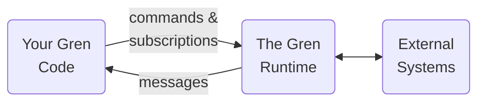

Gren code has some interesting properties:

* It can't raise exceptions.
* It can't change anything (variables, files, databases).
* Functions _always_ return the same value for a given input.

This keeps your code [simple](https://gren-lang.org/book/#simple), but how do you _do_ anything?

Think about making an HTTP request.
Normally, what happens would depend on what's on the server, it could change something on the server, or even raise an exception.
These are usually called "side effects".

In Gren, side effects are handled by the **Gren Runtime**.
Your application code can't trigger side effects directly.
Instead, it can tell the runtime what it wants to do using things called [**commands**](https://packages.gren-lang.org/package/gren-lang/core/version/latest/module/Platform.Cmd) and [**subscriptions**](https://packages.gren-lang.org/package/gren-lang/core/version/latest/module/Platform.Sub).
The runtime can then send your application **messages** about the results of those side effects.

In the next sections you will see what this looks like in practice.
