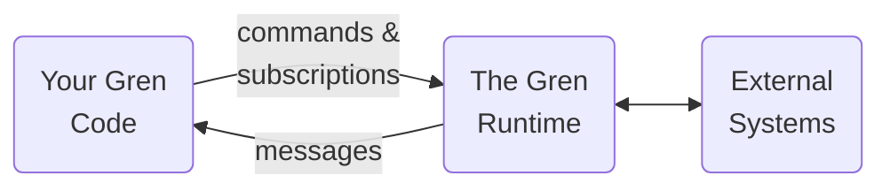
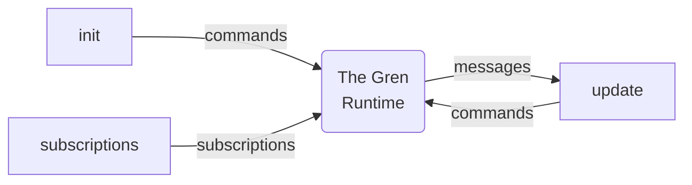

Gren code has some interesting properties:

* It can't raise exceptions.
* It can't change anything (variables, files, databases).
* Functions _always_ return the same value for a given input.

This keeps your code [simple](https://gren-lang.org/book/#simple), but how do you _do_ anything?

Think about making an HTTP request.
Normally, what happens would depend on what's on the server, it could change something on the server, or even raise an exception.
These are usually called "side effects".

In Gren, side effects are handled by the **Gren Runtime**.
Your application code can't trigger side effects directly.
Instead, it can tell the runtime what it wants to do using things called [**commands**](https://packages.gren-lang.org/package/gren-lang/core/version/latest/module/Platform.Cmd) and [**subscriptions**](https://packages.gren-lang.org/package/gren-lang/core/version/latest/module/Platform.Sub).
The runtime can then send your application **messages** about the results of those side effects.

## Commands, Subscriptions, and Messages

[Commands](https://packages.gren-lang.org/package/gren-lang/core/version/latest/module/Platform.Cmd)
are values representing an _effect_ you want to perform.
You can think of an effect as something that doesn't conform to the three properties of Gren code described above:
- It could fail (like reading from local storage or making an HTTP call)
- It could change something (like writing to the file system or updating a database)
- It won't _always_ result in the same value (like reading a file or querying a database), or it might not result in any value at all!

[Subscriptions](https://packages.gren-lang.org/package/gren-lang/core/version/latest/module/Platform.Sub)
are values that let you tell the Gren runtime that you want to be notified when something happens.
Like requests to a web server, or a window being resized.

Messages are values the runtime can send back to your application depending on the results of a command, or events on a subscription.

## Interacting with the Gren Runtime

[The Elm Architecture](/book/applications/tea) provides three points for interaction with the Gren runtime:

- Your `init` function initializes your model when the application starts, but it can also send a command to the runtime if you need an effect right at the start.
- Your `update` function is where (and the only place where) you will receive messages from the Gren runtime in response to your commands and subscriptions.
  In addition to updating the model, you can also kick off new commands in response to the messages you receive.
- Your `subscriptions` function lets you tell the runtime about certain events you want to receive messages about.
  
In the next sections you will see what this looks like in practice.
