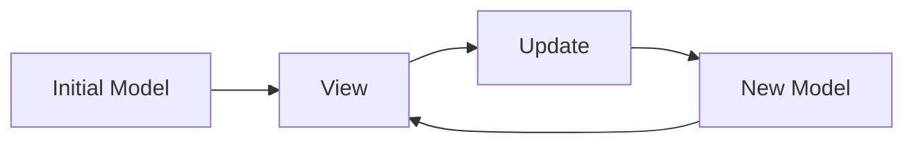

Gren applications follow [The Elm Architecture](https://guide.elm-lang.org/architecture/).

There are three main concepts with this type of architecture:

* **Model**: Holds your application state. "Application state" is the runtime data your application cares about. For example, the current logged in user might be part of your model.
* **View**: Renders the UI for your application state. This might be an HTML page, a JSON response, or some text on the command line.
* **Update**: Modifies your application state in response to events. Maybe a user clicked logout, so you return a new model with the user removed.

As your application runs, the path through the architecture looks like this:

In the next sections we'll cover how to write programs that use this architecture.
